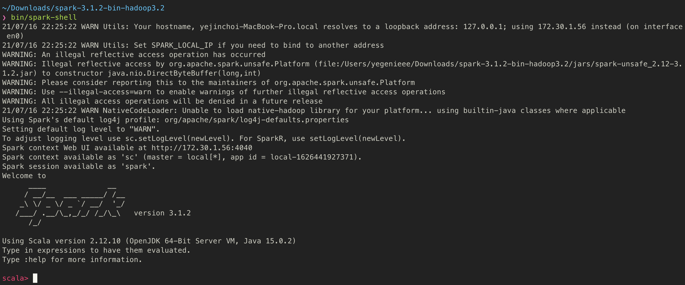
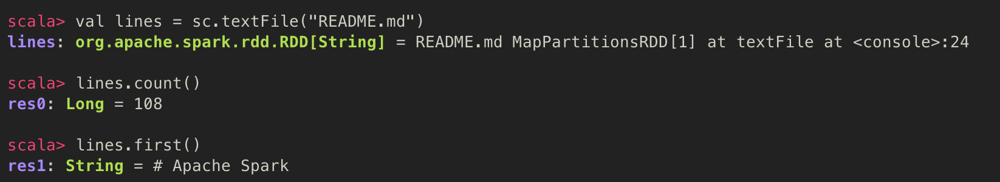
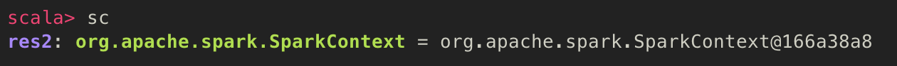
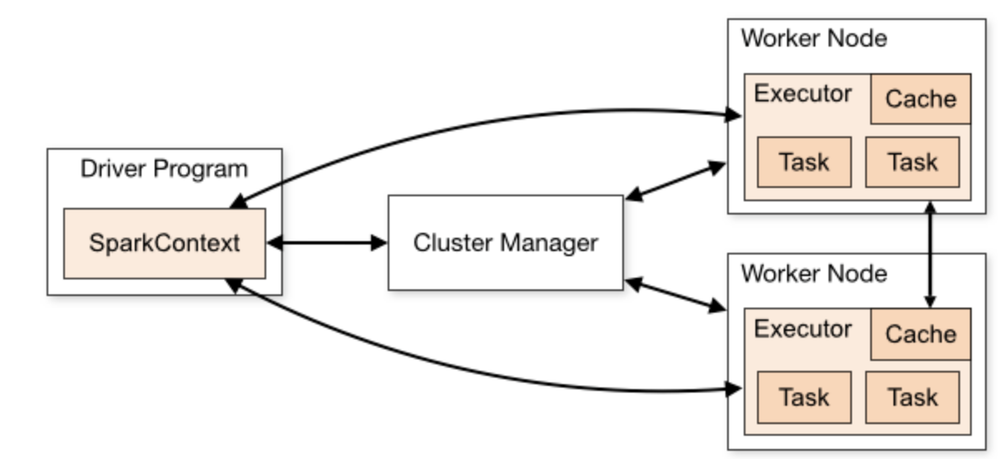
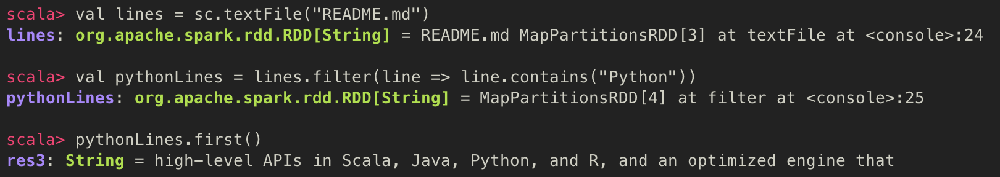

# [2] 스파크 맛보기

### 학습 목표

#### 1. 스파크를 다운 받아 local mode로 실행해볼 수 있다


## 1. 스파크 다운로드 하기

  스파크 자체는 스칼라로 만들어졌으며, 자바 가상 머신 (JVM) 위에서 돌아간다. 이는 스파크의 특징은 아니고, 스칼라 언어의 특징이다. 스파크를 사용하기 위해 스파크 바이너리를 다운로드 하자.

http://spark.apache.org/downloads.html 에 접속하여 압축 tar 파일을 다운받자.


### 스칼라 셸 열기

```bash
$ bin/spark-shell
```



셸을 열면 위와 같이 셸 프롬프트를 확인 할 수 있다.

  스파크에서는 연산 과정을 클러스터 전체에 걸쳐 자동으로 병렬화해 분산 배치된 연산 작업들의 모음으로 표현한다. 이 모음은 RDD (Resilient Distributed Dataset) 라고 부른다. RDD는 분산 데이터와 연산을 위한 스파크의 핵심적인 개념이다. 

  RDD에 대해 간단히 확인해보자. 

1. 먼저 `lines` 라는 RDD를 만든다.

   ```scala
   val lines = sc.textFile("README.md")
   ```

   

2. 이 RDD의 아이템 개수를 센다.

   ```scala
   lines.count()
   ```

   

3. 이 RDD의 첫번째 아이템을 가져온다.

   ```scala
   lines.first()
   ```



- 위 예제를 통해 lines라는 변수에 RDD를 만들어보았다.
  - RDD에서는 RDD가 가지고 있는 데이터세트의 항목 개수를 세는 등의 다양한 병렬 작업을 실행할 수 있다
    - 여기서 RDD가 가지고 있는 데이터세트는 README.md 텍스트 파일의 각 라인이 하나의 항목이다


## 2. 스파크의 핵심 개념 소개

  스파크 애플리케이션은 클러스터에서 다양한 병렬 연산을 수행하는 **드라이버 프로그램**으로 구성된다. 드라이버 프로그램은 개발자가 만든 애플리케이션의 main 함수를 갖고 있으며, 클러스터의 분산 데이터세트를 정의하고 그 데이터세트에 연산 작업을 수행한다. 

  드라이버 프로그램들은 연산 클러스터에 대한 연결을 나타내는 `SparkContext` 객체를 통해 스파크에 접속한다. 셸에서 `SparkContext` 객체는 자동으로 sc 변수에 만들어진다.



 `SparkContext` 객체를 하나 만들었다면, 그걸로 RDD를 만들어 낼 수 있다.


  드라이버 프로그램들은 **executor** 라고 불리는 다수의 노드(클러스터의 머신 하나, 익스큐터 프로그램이 실행되는 머신)를 관리한다. 예를 들어서, count() 를 클러스터에서 실행했다면, 클러스터의 각 머신들은 파일의 서로 다른 부분을 처리했을 것이다. 그러나 우리는 로컬 모드로 스파크 셸을 실행했으므로, 스파크는 하나의 머신에서 모든 작업을 처리한다. 

  스파크는 클러스터에서 분산 실행을 위해 아래와 같이 실행된다. 또한, 스파크 API들은 클러스터에서 각종 연산 작업들을 수행하기 위해 원하는 함수를 작성해 연산 함수에 인자로 보내는 식으로 동작한다.



*[출처] : https://spark.apache.org/docs/latest/cluster-overview.html*


#### 스칼라 필터링 예제 - 특정 단어만 있는 라인을 걸러내기



- 스파크 API들은 클러스터 위에서 실행되는데, 병렬 처리까지 동시에 된다는 장점이 있다. 그러므로, 하나의 프로그램만 작성하여 돌려도, 실제 실행 노드로 보내주기에, 여러 개의 노드에서 돌아갈 수 있게 되는 것이다.


## 3. 단독 애플리케이션

  스파크를 셸이 아닌 standalone 프로그램 내에서도 사용할 수 있다. 직접 `SparkContext` 를 초기화해주어야 한다.

스파크와 연동하는 방법은 언어마다 다른데, 자바나 스칼라에서는 `Maven` 의존성 필드에 `spark-core` artifact를 써주면 된다.

> Maven
>
> - 자바 기반 언어들이 공개된 저장소의 라이브러리를 가져와 링크하게 해주는 패키지 관리 툴


### SparkContext 초기화하기

  한 애플리케이션이 스파크에 연동되려면 프로그램 내에서 관련 스파크 패키지들을 import 하고, SparkContext 객체를 생성해야 한다. 이를 위해서는 먼저 `SparkConf` 객체를 만들어 설정을 해야 SparkContext를 생성할 수 있다.

#### 스칼라에서 스파크 초기화 하기

```scala
import org.apache.spark.SparkConf
import org.apache.spark.SparkContext
import org.apache.spark.SparkContext_

val conf = new SparkConf().setMaster("local").setAppName("My App")
val sc = new SparkContext(conf)
```


#### 자바에서 스파크 초기화 하기

```java
import org.apache.spark.SparkConf;
import org.apache.spark.api.java.JavaSparkContext;

SparkConf conf = new SparkConf().setMaster("local").setAppName("My App");
JavaSparkContext sc = new JavaSparkContext(conf);
```


  위의 예제는 SparkContext 를 초기화하는 가장 간단한 예제를 보여준다. 초기화 시 두 가지 인자를 전달해주어야 한다.

1. 클러스터 URL
   - 스파크에게 어떤 식으로 클러스터에게 접속할 지 알려줌
   - local은 한 개의 스레드나 단일의 로컬 머신에서 돌 때 따로 접속할 필요가 없을을 알려줌
2. 애플리케이션 이름
   - 클러스터에 접속한다면 클러스터 UI에서 해당 이름으로 애플리케이션을 구분 가능


이렇게 SparkContext를 초기화했다면, 앞에 나왔던 모든 메소드들을 써서 RDD를 만들고 다룰 수 있다.

스파크를 shutdown 하려면, SparkContext에서 `stop()` 메소드를 호출하거나 애플리케이션을 끝내면 된다.


### 단독 애플리케이션 빌드하기

  분산 프레임워크에서 다수의 머신들이 파일 읽기와 결과 합산을 수행하는 예제를 보자. 


## Reference

- 홀든 카로, 앤디 콘빈스키, 패트릭 웬델, 마테이 자하리아, 『러닝 스파크』, 제이펍(2015), p.11~ p.27
