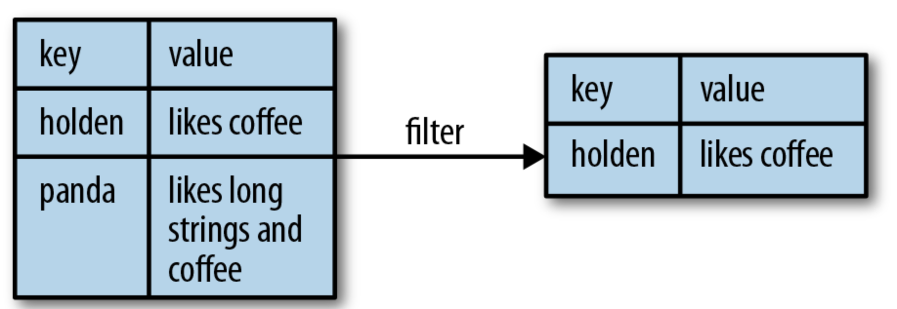
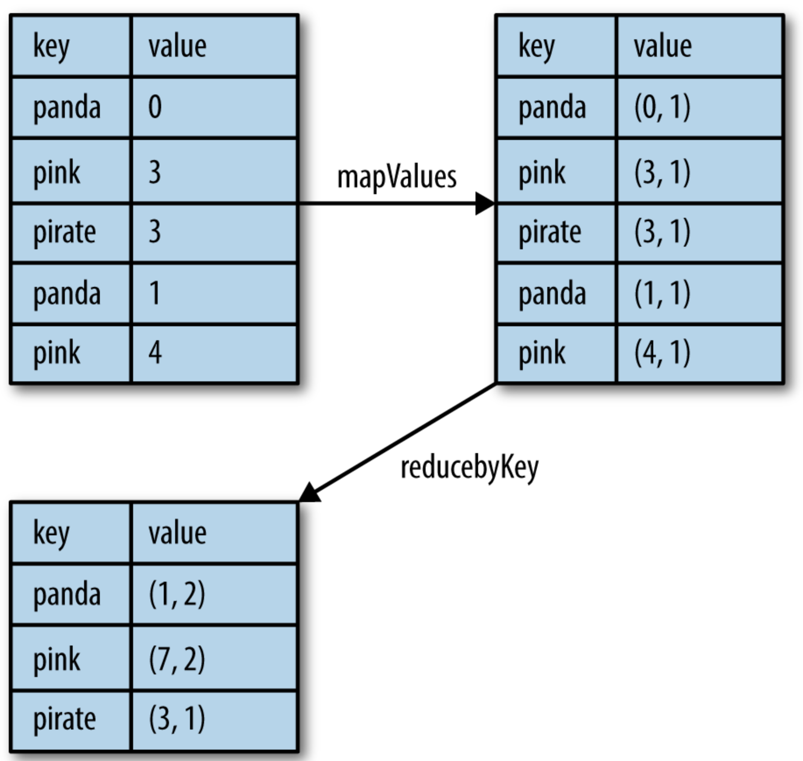

# [4] 키/값 페어로 작업하기

### 학습 목표

#### 1. 스파크의 많은 작업에서 필요로 하는 기본 데이터 타입 중의 하나인 키/값 페어 RDD로 어떻게 작업하는지 알 수 있다.

#### 2. 파티셔닝에 대해 알 수 있다.


## 0. 배경

  스파크는 키/값 쌍을 가지고 있는 RDD에 대해 특수한 연산들을 제공한다. 이 RDD들은 페어 RDD라고 불리는데, Pair RDD 들은 각 키에 대해 병렬로 처리하거나 네트워크 상에서 데이터를 다시 그룹핑하는 역할을 한다. 예를 들어, reduceByKey(), join() 등의 메소드들을 갖고 있다.


## 1. Pair RDD 생성

  일반 RDD를 Pair RDD로 만들기 위해서는 키/값 쌍을 되돌려주는 `map()` 함수를 써서 변환할 수 있다. 키/값 RDD를 생성하는 방법은 언어마다 다르다.


#### 스칼라에서 첫번째 단어를 키로 사용한 페어 RDD 생성

```scala
val pairs = lines.map(x => (x.split(" ")(0), x))
```

- 스칼라에서는 키를 가지는 데이터를 위한 함수들을 위해 튜플을 리턴해야 한다. 튜플의 RDD에는 추가적인 키/값 함수들을 제공하기 위해 묵시적인 변환이 있다
- 메모리에 있는 데이터로부터 페어 RDD를 만드려면 페어 데이터세트에 `SparkContext.parallelize()` 를 호출하면 된다


####자바에서 첫번째 단어를 키로 사용한 페어 RDD 생성

```java
PairFunction<String, String, String> keyData = 
	new PairFunction<String, String, String>() {
		public Tuple2<String, String> call(String x) {
			return new Tuple2(x.split(" ")[0], x);
		}
	};
JavaPairRDD<String, String> pairs = lines.mapToPair(keyData);
```

- 자바는 내장 튜플 타입이 없으므로 스파크의 자바 API에서 `scala.Tuple2` 클래스를 사용하여 사용자가 튜플을 만들어야 한다
- 메모리에 있는 데이터로부터 페어 RDD를 만드려면 페어 데이터세트에 `SparkContext.parallelizePairs()` 를 호출하면 된다 


## 2. Pair RDD Transformation

  Pair RDD는 기본 RDD에서 가능한 모든 transformation을 사용할 수 있다. 


#### PairRDD의 트랜스포메이션 (ex) {(1, 2), (3, 4), (3, 6)})

| 함수 이름                                                    | 목적                                                         | 예                               | 결과                                             |
| ------------------------------------------------------------ | ------------------------------------------------------------ | -------------------------------- | ------------------------------------------------ |
| reduceByKey(func)                                            | 동일 키에 대한 값들을 합친다                                 | rdd.reduceByKey((x, y) => x + y) | {(1, 2), (3, 10)}                                |
| groupByKey()                                                 | 동일 키에 대한 값들을 그룹화한다                             | rdd.groupByKey()                 | {(1, [2]), (3, [4, 6])}                          |
| combineByKey(createCombiner, mergeValue, mergeCombiners, partitioner) | 다른 결과 타입을 써서 동일 키의 값들을 합친다                |                                  |                                                  |
| mapValues(func)                                              | 키의 변경 없이 pairRDD의 각 값에 함수를 적용한다             | rdd.mapValues(x => x + 1)        | {(1, 3), (3, 5), (3, 7)}                         |
| flatMapValues(func)                                          | pairRDD의 각 값에 대해 반복자를 리턴하는 함수를 적용하고, 리턴 받은 값들에 대해 기존 키를 써서 키/값 쌍을 만든다. <br />종종 토큰 분리에 쓰임 | rdd.flatMapValues(x => (x to 5)) | {(1, 2), (1, 3), (1, 4), (1, 5), (3, 4), (3, 5)} |
| keys()                                                       | RDD가 가진 키들만을 되돌려 준다                              | rdd.keys()                       | {1, 3, 3}                                        |
| values()                                                     | RDD가 가진 값들만을 되돌려 준다                              | rdd.values()                     | {2, 4, 6}                                        |
| sortByKey()                                                  | 키로 정렬된 RDD를 되돌려 준다                                | rdd.sortByKey()                  | {(1, 2), (3, 4), (3, 6)}                         |


#### 두 pairRDD에 대한 transformation (rdd = {(1, 2), (3, 4), (3, 6)}, other = {(3, 9)})

| 함수 이름      | 목적                                                         | 예                        | 결과                                                   |
| -------------- | ------------------------------------------------------------ | ------------------------- | ------------------------------------------------------ |
| subtractByKey  | 다른 쪽 RDD에 있는 키를 써서 RDD의 데이터를 삭제한다         | rdd.subtractByKey(other)  | {(1, 2)}                                               |
| join           | 두 RDD에 대해 inner join을 수행한다                          | rdd.join(other)           | {(3, (4, 9)), (3, (6, 9))}                             |
| rightOuterJoin | 첫 번째 RDD에 있는 키들을 대상으로 두 RDD간에 조인을 수행한다 | rdd.rightOuterJoin(other) | {(3, (Some(4), 9)) , (3, (Some(6), 9))}                |
| leftOuterJoin  | 다른쪽 RDD에 있는 키들을 대상으로 두 RDD간에 조인을 수행한다 | rdd.leftOuterJoin(other)  | {(1, (2, None)), (3, (4, Some(9))), (3, (6, Some(9)))} |
| cogroup        | 동일 키에 대해 양쪽 RDD를 그룹화                             | rdd.cogroup(other)        | {(1, ([2], [])), (3, ([4, 6], [9]))}                   |

- pairRDD도 여전히 일반적인 RDD이므로 RDD에서 지원하는 함수들을 그대로 지원함


#### 스칼라에서 두 번째 요소에 대한 단순 필터 적용

```scala
pairs.filter{case (key, value) => value.length < 20}
```



*[출처] : https://www.oreilly.com/library/view/learning-spark/9781449359034/ch04.html*


### 1. 집합 연산

  데이터세트가 키/값 쌍으로 표현될 때 동일 키에 대해 집계된 통계를 산출하는 작업은 매우 흔한 일이어서, 스파크는 각 키에 대해 값들을 합쳐주는 유사한 종류의 연산을 제공한다. 이러한 연산들은 RDD를 리턴하므로, 액션보다는 트랜스포메이션이라고 할 수 있다.


#### reduceByKey()

- `reduce()` 와 매우 유사
- 함수를 받아서 값들을 합치는 데 이용
- 여러 개의 병합 연산을 실행하는데, 하나의 연산은 하나의 키에 대한 작업이 되고, 각 작업은 동일 키에 대한 값을 하나로 합침
- 데이터세트의 키가 매우 많을 수도 있으므로, 값 하나를 사용자에게 되돌려주는 액션으로 구현되는 것이 아니라, **각 키와 키에 대해 합쳐진 값으로 구성된 새로운 RDD를 리턴**


#### foldByKey()

- `fold()` 와 유사
- RDD의 데이터 타입과 동일한 zeroValue와 함께 값이 병합되는 함수를 필요로 함
- 제공되는 zeroValue는 다른 데이터값과 병합 함수에서 합쳐질 때 값의 변경이 일어나면 안됨


#### 스칼라에서 reduceByKey() 와 mapValues()로 키 별 평균 구하기

```scala
rdd.mapValues(x => (x, 1)).reduceByKey((x, y) => (x._1 + y._1, x._2 + y._2))
```



[출처] : https://www.oreilly.com/library/view/learning-spark/9781449359034/ch04.html

- 그림은 평균을 구하기 직전의 상태 (값의 총합, 값의 개수) 형태
- 평균을 구하려면, 총 합을 개수로 나누면 평균값을 구할 수 있음


#### 스칼라에서의 단어 세기

```scala
val input = sc.textFile("s3://...")
val words = input.flatMap(x => x.split(" "))
val result = words.map(x => (x, 1)).reduceByKey((x, y) => x + y)
```


#### combineByKey()

- 키/값 집합 연산 함수 중 가장 일반적으로 쓰임
- 대부분의 다른 키 별 컴파이너들은 이를 기반으로 구현됨
- 입력 데이터와 동일한 타입의 값을 되돌려 줄 필요는 없음
- **처리하는 각 데이터를 어떤 식으로 다루는지 생각해야 함**
- 한 파티션 내의 데이터들을 하나씩 처리하게 되며, 각 데이터는 이전에 나온 적이 없는 키를 가지고 있을 수도 있고, 이전 데이터와 같은 키를 가질 수도 있음
- 새로운 데이터가 들어왔을 때 combineByKey() 의 데이터 처리 방식
  - 넘겨준 `createCombiner()` 를 사용하여 해당 키에 대한 accumulator (스파크에서는 계속 관리가 될 필요가 있는 값을 의미) 의 초기값을 만든다
  - 


## Reference

- 홀든 카로, 앤디 콘빈스키, 패트릭 웬델, 마테이 자하리아, 『러닝 스파크』, 제이펍(2015), p.59~ p.57

