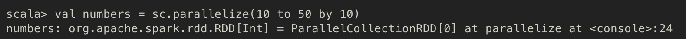
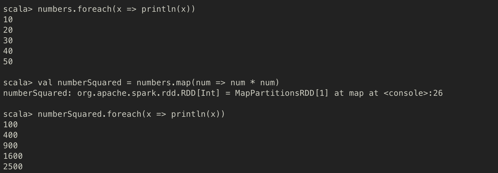
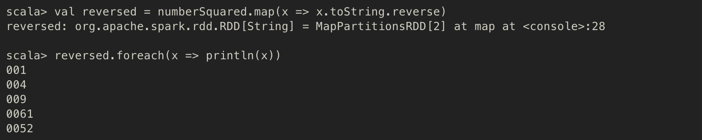
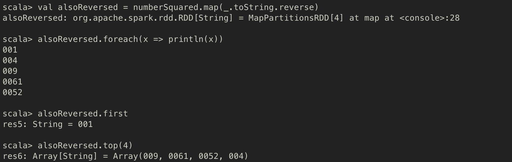

# Spark의 기초

## 학습목표
1. RDD
2. RDD의 transformation 연산자
3. RDD의 action 연산자
4. lazy evaluation

## 1. RDD
- Resilient Distributed Dataset
- 스파크 전용 분산 컬렉션, 스파크의 기본 추상화 객체

### 특징
1. Immutable (불변성) : Read-only
   - RDD는 데이터를 조작할 수 있는 다양한 `transformation(변환)` 연산자를 제공하는데, `transformation` 연산자는 항상 새로운 RDD객체를 생성한다.
  - 즉, 한 번 생성된 RDD는 **절대 바뀌지 않는다**.
2. Resilient (복원성) : Fault tolerance
   - 노드에 장애가 발생해도 유실된 RDD를 원래대로 복구할 수 있다.
        > 어떻게 복구할 수 있는 것인지?
          - 일반적인 분산 프레임워크 : Replica를 가져와서 데이터를 복원한다.
          - Spark의 RDD : 데이터셋을 만드는 데 사용된 transformation(변환) 연산자의 로그를 남기므로, <br> 이 로그를 이용해서 해당 노드가 가진 데이터셋만 다시 계산해서 RDD를 복원한다. (데이터셋의 replica를 저장하는 방법이 아니다)
3. Distributed (분산) : 노드 한 개 이상에 저장된 데이터셋

## 목적
- 분산 컬렉션의 성질과 fault-tolerance를 추상화하고 직관적인 방식으로 대규모 데이터셋에 병렬 연산을 수행할 수 있도록 한다.

## 2. RDD의 transformation 연산자
- RDD 연산자는 transformation / action 두 유형의 연산자로 나뉜다.
- transformation 연산자는 RDD의 데이터를 조작해서 새로운 RDD를 생성한다.

### 1. map
- 원본 RDD의 요소를 변환한 후 변환된 요소로 새로운 RDD를 생성하는 transformation 연산자
- map method signature
```Scala
class RDD[T] { // RDD는 타입 매개변수 T를 가진 클래스로 정의
  // other methods
  def map[U](f: (T) => U): RDD[U] // map 함수는 또 다른 함수(f: (T) => U) 를 인자로 받아서 이 RDD와는 다른 타입(U)의 RDD를 return한다
  // other methods
}
```
- 또 다른 함수를 인자로 받아서 RDD 하나를 반환한다, map 함수가 반환하는 RDD는 map 함수가 호출된 RDD와는 다른 타입의 요소일 수도 있다.

#### map 을 이용해 RDD 요소의 제곱 값을 계산하는 예제

- `parallelize` : Seq 객체를 받아서 Seq 객체의 요소로 구성된 RDD를 생성한다.
    - Seq는 spark의 collection interface로, 이 인터페이스를 구현한 클래스에는 Array나 List 등이 있다.
    - 새로운 RDD를 만들 때, Seq 객체의 요소는 여러 Spark Executor(실행자)로 분산된다.


#### String type의 RDD로 변환 후 각 문자열의 순서를 뒤집는 예제

- placeholder를 이용하여 더 간결하게 작성

> #### placeholder syntax (위치 표시자 구문)
> - `_(underscore)`를 이용하여, 함수 호출과 함께 전달되는 인수가 차리할 자리를 미리 선점
> - 위의 예제에서는 이 함수가 호출될 때 인자로 전달된 객체가 무엇이든 이 객체의 toString -> reverse를 호출하라는 의미 !

### 2. distinct & flatMap
-
