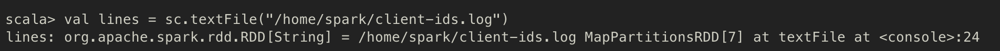
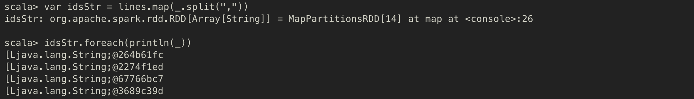
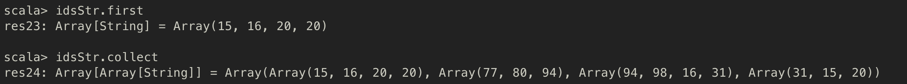
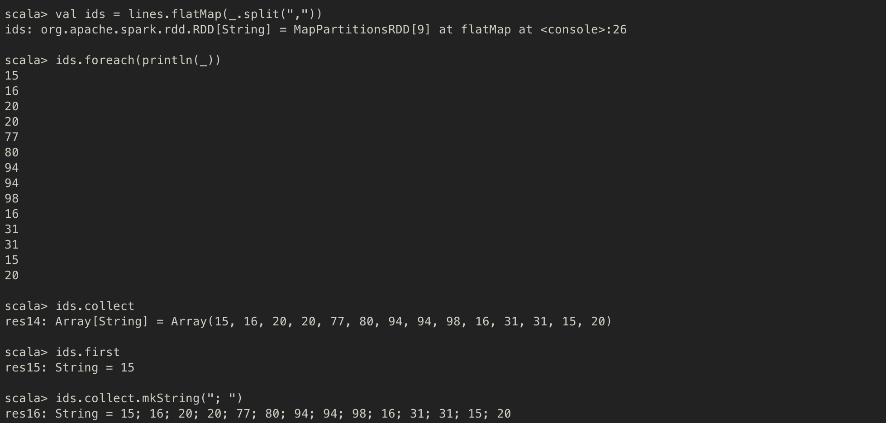
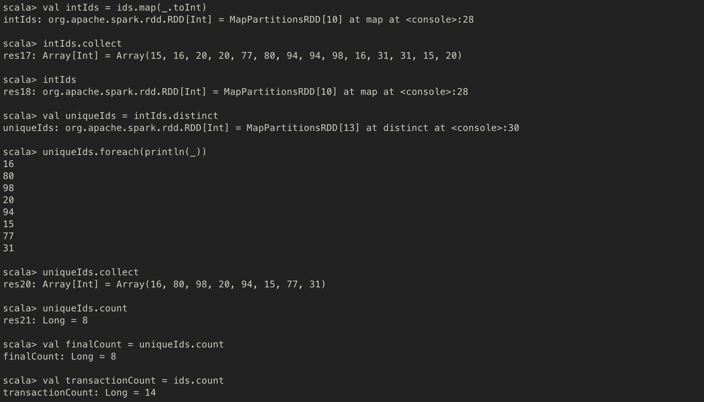
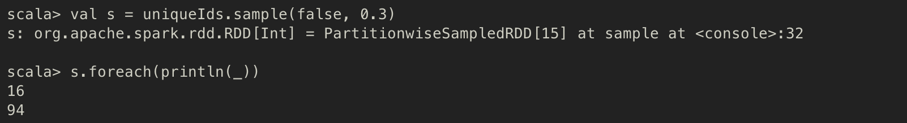
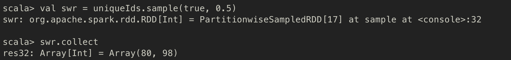
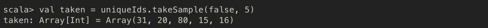
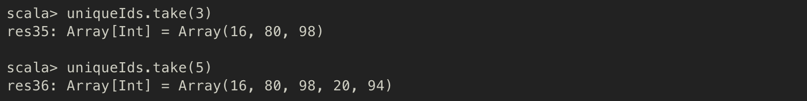

# Spark의 기초
---
## 학습목표
1. RDD
2. RDD의 transformation 연산자
3. RDD의 action 연산자
4. lazy evaluation

---
## 1. RDD
- Resilient Distributed Dataset
- 스파크 전용 분산 컬렉션, 스파크의 기본 추상화 객체

### 특징
1. Immutable (불변성) : Read-only
   - RDD는 데이터를 조작할 수 있는 다양한 `transformation(변환)` 연산자를 제공하는데, `transformation` 연산자는 항상 새로운 RDD객체를 생성한다.
   - 즉, 한 번 생성된 RDD는 **절대 바뀌지 않는다**.
2. Resilient (복원성) : Fault tolerance
   - 노드에 장애가 발생해도 유실된 RDD를 원래대로 복구할 수 있다.

        > 어떻게 복구할 수 있는 것인지?
          - 일반적인 분산 프레임워크 : Replica를 가져와서 데이터를 복원한다.
          - Spark의 RDD : 데이터셋을 만드는 데 사용된 transformation(변환) 연산자의 로그를 남기므로, <br> 이 로그를 이용해서 해당 노드가 가진 데이터셋만 다시 계산해서 RDD를 복원한다. (데이터셋의 replica를 저장하는 방법이 아니다)
3. Distributed (분산) : 노드 한 개 이상에 저장된 데이터셋

## 목적
- 분산 컬렉션의 성질과 fault-tolerance를 추상화하고 직관적인 방식으로 대규모 데이터셋에 병렬 연산을 수행할 수 있도록 한다.

---

## 2. RDD의 transformation 연산자
- RDD 연산자는 transformation / action 두 유형의 연산자로 나뉜다.
- transformation 연산자는 RDD의 데이터를 조작해서 새로운 RDD를 생성한다.

### 1. map
- 원본 RDD의 요소를 변환한 후 변환된 요소로 새로운 RDD를 생성하는 transformation 연산자
- *map method signature*
    ```Scala
    class RDD[T] { // RDD는 타입 매개변수 T를 가진 클래스로 정의
      // other methods
      def map[U](f: (T) => U): RDD[U] // map 함수는 또 다른 함수(f: (T) => U) 를 인자로 받아서 이 RDD와는 다른 타입(U)의 RDD를 return한다
      // other methods
    }
    ```
- 또 다른 함수를 인자로 받아서 RDD 하나를 반환한다, map 함수가 반환하는 RDD는 map 함수가 호출된 RDD와는 다른 타입의 요소일 수도 있다.

#### map 을 이용해 RDD 요소의 제곱 값을 계산하는 예제

- `parallelize` : Seq 객체를 받아서 Seq 객체의 요소로 구성된 RDD를 생성한다.
    - Seq는 spark의 collection interface로, 이 인터페이스를 구현한 클래스에는 Array나 List 등이 있다.
    - 새로운 RDD를 만들 때, Seq 객체의 요소는 여러 Spark Executor(실행자)로 분산된다.


#### String type의 RDD로 변환 후 각 문자열의 순서를 뒤집는 예제

- placeholder를 이용하여 더 간결하게 작성


> #### placeholder syntax (위치 표시자 구문)
> - `_(underscore)`를 이용하여, 함수 호출과 함께 전달되는 인수가 차리할 자리를 미리 선점
> - 위의 예제에서는 이 함수가 호출될 때 인자로 전달된 객체가 무엇이든 이 객체의 toString -> reverse를 호출하라는 의미 !

### 2. flatMap & distinct
#### flatMap
- `map` : 원본 RDD의 요소를 변환해서 새로운 RDD를 생성하는 transformation 연산자
- `flatMap` : 반환한 여러 배열의 모든 요소를 단일 배열로 return 하는 transformation 연산자
    - 주어진 함수를 RDD의 모든 요소에 적용한다는 점은 map과 동일하지만, 익명 함수가 반환한 배열의 중첩 구조를 한 단계 제거하고 모든 배열의 요소를 **단일 컬렉션으로 병합** 한다는 특징이 있다.
- *flatmap method signature*
    ```Scala
    def flatMap[U](f: (T) => TraversableOnce[U]): RDD[U]
    ```


#### distinct
- 중복 요소를 제거한 새로운 RDD를 반환한다.
- 해당 RDD의 고유 요소로 새로운 RDD를 생성하는 transformation 연산자
- *distinct method signature*
    ```Scala
    def distinct(): RDD[T]
    ```

#### 최소 한 번 이상 상품을 구매한 고객을 확인하는 예제
- `~/client-ids.log` 파일에 고객의 구매 이력(구매 고객의 id)이 담겨있다.
- 로그 파일을 스파크로 로드한다.

- 로그 파일의 각 줄을 쉼표로 분리해서 문자열 배열을 생성한다.

- 출력해보면, 고객 ID의 배열로 RDD가 구성된 것을 알 수 있다.


> collect (Action 연산자)
> - 새로운 배열을 생성해서, RDD의 모든 요소를 이 배열에 모아서 return하는 연산자

- 이상하다. 배열의 배열을 **단일배열**로 분해해서 한 번에 리턴하려면?
- **flatMap** 을 쓰자

- 단일 배열이 반환되는 것을 확인할 수 있다.

> mkString (scala Array class method)
> - 배열의 모든 요소를 문자열 하나로 병합, 메서드에 전달한 인수는 문자열의 separator로 사용한다.

- `ids` RDD의 요소를 `Int` 타입으로 변환 후, 중복 요소를 제거해보자.

- 최소 한 번 이상 상품을 구매한 고객이 총 8명이며, 전체 구매 횟수는 14회라는 것을 알아냈다.

### 3. sample, take, takeSample
#### sample
- `sample` : 호출된 RDD에서 무작위로 요소를 뽑아서 새로운 RDD를 만드는 transformation 연산자
- *sample method signature*
  ```scala
  def sample(withReplacement: Boolean, fraction: Double, seed: Long = Utils.random.nextLong): RDD[T]
  ```
   - `withReplacement` : 같은 요소가 여러번 샘플링 될 수 있는지 지 (false면 한 번 샘플링 된 요소는 메서드 호출이 끝날 때까지 다음 샘플링 대상에서 제외됨)

       > - Sampling with replacement (복원 샘플링)
       >     - 물고기를 한 마리 잡아서 크기를 재고, 다음 물고기를 잡기 전에 이 물고기를 물로 되돌려 보내는 것과 같음 (같은 물고기를 여러 번 잡을 가능성이 있음)
       > - Sampling without replacement (비복원 샘플링)
       >     - 잡은 물고기는 되돌려보내지 않는 경우 (같은 물고기를 여러 번 잡지 않음)

   - `fraction` : 복원 샘플링에서는 각 요소가 샘플링 될 횟수의 기댓값 (0 이상의 값), 비복원 샘플링에서는 각 요소가 샘플링 될 기대 확률 (0 ~ 1 사이의 부동소수점 숫자)
   - `seed` : 난수 생성에 이용




#### takeSample
- 확률 값 대신 정확한 개수로 RDD의 요소를 샘플링하는 경우 이용하는 action 연산자
- *takeSample method signature*
   ```Scala
   def takeSample(withReplacement: Boolean, num: Int, seed: Long = Utils.random.nextLong): Array[T]
   ```
   - `num` : 샘플링 결과로 반환될 요소의 개수를 지정하는 변수 (요소 개수의 기대값이 아니라 항상 정확한 개수로 샘플링하게 된다)
   - takeSample은 *action* 연산자이다. sample은 transformation 연산자이다.



#### take
- 지정된 개수의 요소를 모을 때까지 RDD의 파티션 (클러스터의 여러 노드에 저장된 데이터의 일부분)을 하나씩 처리해서 결과를 반환한다.
   - 파티션을 하나씩 처리한다는 말은 연산이 `전혀 분산되지 않는다`는 의미
   - 여러 파티션의 요소를 빠르게 가져오고 싶다면 드라이버의 메모리를 넘지 않도록 요소 개수를 줄이고 collect 연산자를 사용해야 한다.
- RDD의 데이터를 살짝 엿보는 데 자주 사용한다.
- take 메서드의 결과는 단일 머신에 전송되므로 인자에 너무 큰 수를 지정해서는 안된다.



---

## 3. RDD의 action 연산자
- 연산자를 호출한 프로그램으로 연산 결과를 return 하거나 RDD 요소에 특정 작업을 수행하려고 실제 계산을 시작하는 역할을 하는 연산자
   - ex) count, foreach

---

## 4. Lazy evaluation (지연 실행)
- 스파크에서 transformation 연산자는 지연 실행되는데, **action** 연산자를 호출하기 전까지는 transformation 연산자의 계산을 **실제로 실행하지 않는 것**을 의미한다.
- RDD에 action 연산자가 호출되면 스파크는 그 때 RDD Lineage (계보)를 살펴보고, 이를 바탕으로 실행해야 하는 **연산 그래프**를 작성해서 action 연산자를 계산한다.
- 결국, transformation 연산자는 Action 연산자를 호출했을 때, 무슨 연산이 어떤 순서로 실행되어야 하는지를 알려주는 일종의 `설계도` 이다.

---

## Reference

- 페타 제제비치, 마르코 보나치, 『스파크를 다루는 기술 (Spark in Action)』, 길벗(2018), p.52~ p.78
