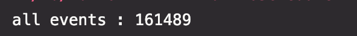

# Spark 예제

---

## 학습목표
1. 간단한 스파크 프로그램을 작성할 수 있다.

---

## 1. 로그 다운로드
```bash
$ cd ~/Desktop/Learning-Spark/spark-in-action/app/src/main/resources
$ wget http://data.githubarchive.org/2022-09-01-{0..23}.json.gz
```


- 파일 압축을 해제한다


- 다운받은 파일의 첫번째 JSON 객체를 출력해보자.


- `jq` 를 이용해서 JSON을 보기좋게 출력해보자


## 2. JSON load
- spark v1.3.0에서 소개된 Spark SQL과 DataFrame은 JSON 데이터를 스파크로 입수하는 기능을 제공한다.
- spark v1.6.0은 DataFrame을 개선하고 일반화한 Dataset을 도입했다.

> DataFrame API
> - DataFrame은 스키마가 있는 RDD로,
> 관계형 데이터베이스 테이블 처럼 각 column 별로 이름과 타입을 가진다.
> - 스키마를 장착한 DataFrame의 강점은 계산 최적화인데, Spark는 정형 데이터셋을 DataFrame으로 생성할 때 전체 Dataset을 탐색하고 **데이터 스키마를 유추**한다.
> - 그 이후, **데이터스키마를 참고해서 실행 계획**을 만들어서 더 나은 계산 최적화를 이끌어 낼 수 있다.

- SparkSQL의 main interface = `SQLContext` 클래스
- spark v2.0에서 `SparkContext`와 `SQLContext`를 합쳐서 `SparkSession` 클래스로 통합하였다.


- *json method signature*
   ```scala
   def json(paths: String*): DataFrame
   // Loads a JSON file (one object per line) and returns the result as a [[DataFrame]].
   ```
   - 한 줄당 JSON 객체 하나가 저장된 파일을 로드하는 메소드


- spark v2.0 부터는 DataFrame이 **`Dataset`** 의 일종, 즉 row 객체를 요소로 포함하는 Dataset으로 변경되었다.

- JSON 파일 로드 후 로그 타입이 `pushEvent` 인 로그 필터링하기
   ```scala
   import org.apache.spark.sql.SparkSession

   object App {
       def main(args: Array[String]): Unit = {
           val spark = SparkSession.builder()
               .appName("GitHub push counter")
               .master("local[*]")
               .getOrCreate()

           val sc = spark.sparkContext

           val homeDir = System.getenv("HOME")
           val inputPath = homeDir + "/Desktop/Learning-Spark/spark-in-action/app/src/main/resources/2022-09-01-0.json"
           val ghLog = spark.read.json(inputPath)

           val pushes = ghLog.filter("type = 'PushEvent'")
       }
   }
   ```

- json 메서드가 유추한 JSON 스키마를 확인할 수 있다.
- 이 스키마는 JSON 파일에 사용된 모든 key의 합집합으로 구성되며, 각 키에는 각 값 타입과 널 값 허용 여부 (nullable)가 할당되어 있다.
   - 유추된 스키마에는 널 값 허용 여부가 항상 `true`로 할당된다.




- DataFrame의 상위 5개 출력 결과를 확인할 수도 있다.
  

## 3. 데이터 집계
```scala
import org.apache.spark.sql.SparkSession

import scala.io.Source.fromFile

object App {
  def main(args: Array[String]): Unit = {
    val spark = SparkSession.builder()
      .appName("GitHub push counter")
      .master("local[*]")
      .getOrCreate()

    val sc = spark.sparkContext

    val homeDir = System.getenv("HOME")
    val inputPath = homeDir + "/Desktop/Learning-Spark/spark-in-action/app/src/main/resources/2022-09-01-0.json"
    val ghLog = spark.read.json(inputPath)

    val pushes = ghLog.filter("type = 'PushEvent'")

    pushes.printSchema()
    println("all events : " + ghLog.count())
    println("only pushes : " + pushes.count())
    pushes.show(5)

    val grouped = pushes.groupBy("actor.login").count()
    grouped.show(5)

    val ordered = grouped.orderBy(grouped("count").desc)
    ordered.show(10)

//    val notBot = ordered.filter("login =!= '%bot%'")
//    notBot.show(20)

    val empPath = homeDir + "/Desktop/Learning-Spark/spark-in-action/app/src/main/resources/ghEmployees.txt" // 직원 파일 로드
    // Scala에서는 Set의 랜덤 룩업 성능이 Seq 컬렉션보다 빠르므로 Set을 사용하는 것이 좋다

    // scala의 for comprehensions
    val employees = Set() ++ { // Set() 메서드는 요소가 없는 불변 Set 객체를 생성한다. // ++ 메서드는 이 Set에 복수 요소를 추가한다
      for {
        line <- fromFile(empPath).getLines
      } yield line.trim
      // yield는 for 루프의 각 사이클 별로 값 하나를 임시 컬렉션에 추가한다. (이 경우에는 line.trim) 임시 컬렉션은 for 루프가 종료될 때 전체 for 표현식의 결과로 반환된 후 삭제된다.
    }

    // 공유 변수를 등록한다. 공유 변수는 클러스터의 각 노드에 정확히 한 번만 전송하고, 클러스터 노드의 메모리에 자동으로 캐시되므로 프로그램 실행 중에 바로 접근할 수 있다는 장점이 있다.
    // 공유 변수를 설정하지 않으면, 스파크는 employees Set을 대략 200회 (필터링 작업을 수행할 태스크 개수) 정도 반복적으로 네트워크에 전송하게 된다.
    // 공유 변수를 교환하는 프로토콜 = 가십 프로토콜 (워커 노드들이 소문을 퍼뜨리는 것 처럼 서로 공유 변수를 교환하는 행위)
    val bcEmployees = sc.broadcast(employees)

    // Spark의 User Defined Function 정의
//    val isEmp: (String => Boolean) = (arg: String) => employees.contains(arg)
//    val isEmp = user => employees.contains(user) // Scala의 type inference (타입 추론)

    import spark.implicits._
    // 공유 변수에 접근하기 위해 value 메소드를 써야 하므로, 변수 참조 부분을 변경한다
    val isEmp = user => bcEmployees.value.contains(user) // Scala의 type inference (타입 추론)

    // UDF를 SparkSession 클래스의 udf 메서드로 등록 -> 이렇게 등록하면 스파크 클러스터에서 UDF를 실행할 수 있다.
    // 스파크는 UDF에 필요한 객체를 모두 가져와서 클러스터에서 실행하는 모든 태스크에 전송한다.
    val isEmployee = spark.udf.register("isEmpUdf", isEmp)

    val filtered = ordered.filter(isEmployee($"login"))
    filtered.show()
  }

}
```
