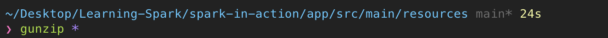

# Spark 예제

---

## 학습목표
1. 간단한 스파크 프로그램을 작성할 수 있다.

---

## 1. 로그 다운로드
```bash
$ cd ~/Desktop/Learning-Spark/spark-in-action/app/src/main/resources
$ wget http://data.githubarchive.org/2022-09-01-{0..23}.json.gz
```


- 파일 압축을 해제한다


- 다운받은 파일의 첫번째 JSON 객체를 출력해보자.


- `jq` 를 이용해서 JSON을 보기좋게 출력해보자


## 2. JSON load
- spark v1.3.0에서 소개된 Spark SQL과 DataFrame은 JSON 데이터를 스파크로 입수하는 기능을 제공한다.
- spark v1.6.0은 DataFrame을 개선하고 일반화한 Dataset을 도입했다.

> DataFrame API
> - DataFrame은 스키마가 있는 RDD로,
> 관계형 데이터베이스 테이블 처럼 각 column 별로 이름과 타입을 가진다.
> - 스키마를 장착한 DataFrame의 강점은 계산 최적화인데, Spark는 정형 데이터셋을 DataFrame으로 생성할 때 전체 Dataset을 탐색하고 **데이터 스키마를 유추**한다.
> - 그 이후, **데이터스키마를 참고해서 실행 계획**을 만들어서 더 나은 계산 최적화를 이끌어 낼 수 있다.

- SparkSQL의 main interface = `SQLContext` 클래스
- spark v2.0에서 `SparkContext`와 `SQLContext`를 합쳐서 `SparkSession` 클래스로 통합하였다.


- *json method signature*
   ```scala
   def json(paths: String*): DataFrame
   // Loads a JSON file (one object per line) and returns the result as a [[DataFrame]].
   ```
   - 한 줄당 JSON 객체 하나가 저장된 파일을 로드하는 메소드


- spark v2.0 부터는 DataFrame이 **`Dataset`** 의 일종, 즉 row 객체를 요소로 포함하는 Dataset으로 변경되었다.

- JSON 파일 로드 후 로그 타입이 `pushEvent` 인 로그 필터링하기
   ```scala
   import org.apache.spark.sql.SparkSession

   object App {
       def main(args: Array[String]): Unit = {
           val spark = SparkSession.builder()
               .appName("GitHub push counter")
               .master("local[*]")
               .getOrCreate()

           val sc = spark.sparkContext

           val homeDir = System.getenv("HOME")
           val inputPath = homeDir + "/Desktop/Learning-Spark/spark-in-action/app/src/main/resources/2022-09-01-0.json"
           val ghLog = spark.read.json(inputPath)

           val pushes = ghLog.filter("type = 'PushEvent'")
       }
   }
   ```
