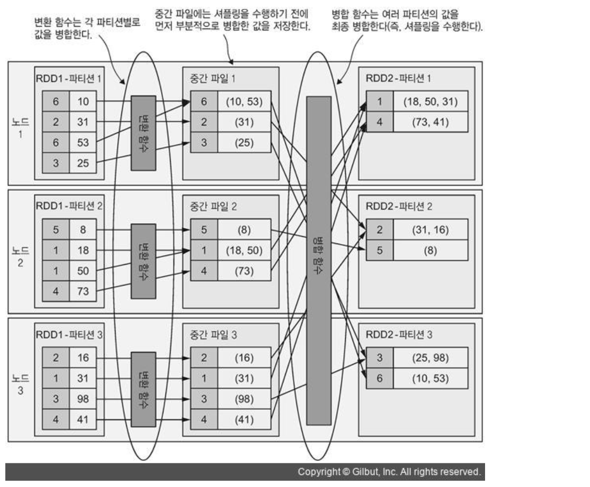

# Data Partitioning과 Data Shuffling

## Data Partitioning
- 데이터를 여러 클러스터 노드로 분할하는 메커니즘
- Spark의 성능과 리소스 점유량을 크게 좌우할 수 있는 RDD의 가장 기본적인 개념

### Spark Cluster
- 병렬 연산이 가능하고 네트워크로 연결된 머신의 집합

### RDD의 Partition
- RDD 데이터의 일부 (조각 또는 슬라이스) => 나누어진 단위를 **파티션** 이라 하고, 이 단위로 관리한다
- HDFS에서는 기본적으로 블록과 파티션이 1:1로 저장되지만, 스파크 API를 이용하면 파티션의 수와 크기를 쉽게 지정할 수 있다.
- ex) 로컬 파일 시스템에 저장된 텍스트 파일을 로드하면, 스파크는 파일 내용을 여러 파티션으로 분할해서 클러스터 노드에 고르게 분산 저장한다
- 여러 파티션을 노드 하나에 저장할 수도 있고, 이렇게 분산된 파티션들이 모여서 RDD 하나를 형성한다.
- Spark는 RDD 별로 RDD의 파티션 목록을 보관하는데 -> RDD의 `partitions` 필드로 제공된다 (Array 타입이어서, `paratitions.size` 필드로 파티션 개수를 알아낼 수 있다)
- 스파크에서는 RDD의 파티션 개수가 매우 중요한데, 파티션 개수가 RDD에 transformation 연산을 실행할 task 개수와 직결되기 때문이다
- 이렇게 스파크에서 파티션의 수와 크기를 조정하고 파티션을 배치하는 방법을 설정하여 RDD의 구조를 제어하는 것 => **파티셔닝**
- 파티션의 수나 크기를 변경하는 것에 따라 스파크 애플리케이션 성능이 크게 달라질 수 있기 때문에 spark 에서의 데이터 파티셔닝을 잘 알아두는 것이 중요하다

## Spark의 Data Partitioner
- RDD의 데이터 파티셔닝은 RDD의 각 요소에 파티션 번호를 할당하는 `Partitioner` 객체가 수행한다.
- 스파크는 Partitioner의 구현체로
    1. HashPartitioner
    2. RangePartitioner
    3. CustomPartitioner (사용자 정의 - Pair RDD에만 사용할 수 있음)

를 제공한다.

### 1. HashPartitioner
- 스파크의 기본 partitioner로, 각 요소의 자바 해시 코드를 단순하게 mod를 이용해서 파티션 번호를 계산한다
  - partitionIndex = hashCode % numberOfPartitions
- 각 요소의 파티션 번호를 거의 무작위로 결정하기 때문에 모든 파티션을 정확하게 같은 크기로 분할할 가능성은 낮다
- 그치만, 대규모 데이터셋을 상대적으로 적은 수의 파티션으로 나누면 대체로 데이터를 고르게 분산시킬 수 있다
- HashPartitioner를 사용할 경우, 데이터 파티션의 기본 개수 = `spark.default.parallelism` 에 지정된 값
  - 만약, 이 값이 없으면, 스파크는 클러스터의 코어 개수를 사용한다

### 2. RangePartitioner
- 정렬된 RDD의 데이터를 거의 같은 범위 간격으로 분할할 수 있다
- 직접 사용하지 않는다

### 3. Pair RDD의 사용자 정의 Partitioner
- 파티션의 데이터를 특정 기준에 따라 정확하게 배치해야 할 경우, 사용자 정의 Partitioner로 PairRDD를 분할할 수 있다.
  - ex) 각 태스크가 특정 키-값 쌍 데이터만 처리해야 할 때 (특정 데이터가 단일 데이터베이스, 단일 데이터베이스 테이블, 단일 사용자 등에 속할 때) 사용자 정의 파티셔너를 쓸 수 있다
- Pair RDD에만 쓸 수 있으며, PairRDD의 transformation 연산자를 호춣할 때 사용자 정의 Partitioner를 인수로 전달한다
  - `mapValues`와 `flatMapValues` 연산자는 항상 파티셔닝을 보존한다
- Pair RDD의 transformation 연산자 호출할 때, Partitioner를 지정하지 않으면, 스파크는 부모 RDD(현재 RDD를 만드는 데 사용한 RDD들)에 지정된 파티션 개수 중에 가장 큰 수를 찾아서 사용한다
  - Partitioner를 지정한 부모 RDD가 없으면, `spark.default.parallelism` 에 지정된 값을 개수로하여 HashPartitioner를 사용한다

## 불필요한 셔플링 줄이기
### Shuffling (셔플링)
- 파티션 간의 물리적인 데이터 이동
- 새로운 RDD의 파티션을 만드려고 여러 파티션의 데이터를 합칠 때 발생한다

- 세 파티션으로 구성된 RDD에 `aggregateByKey` transformation 연산을 수행할 때 발생하는 셔플링 과정
```scala
val prods = transByCust.aggregateByKey(List[String]())(
    (prods, tran) => prods ::: List(tran(3)),
    (prods1, prods2) => prods1 ::: prods2
)
```
- ```scala
  List[String]() // zeroValue
  ```
- ```scala
  (prods,tran) => prods ::: List(tran(3)) // transformation [(U, V) => U] (값의 타입을 변경)
  ```
- ```scala
 (prods1, prods2) => prods1 ::: prods2 // merge [(U, U) => U] (두 값을 하나로 합침)
  ```
- transformation : 각 파티션 별로 내부 값들을 병합한다 (RDD1의 파티션별로 (파티션 1에서부터 파티션 3까지) 각 키의 값을 모아서 리스트를 구성한다)
- 중간 파일에는 셔플링을 수행하기 위해서 부분적으로 병합한 값을 저장한다 (각 노드의 중간 파일에 기록한다)
- merge : 여러 파티션의 값을 최종 병합한다 (=> **셔플링을 수행한다**) (여러 파티션에 저장된 리스트들을 각 키 별 단일 리스트로 병합한다 & 기본 Partitioner인 HashPartitioner를 적용해서 각 키를 적절한 파티션에 할당한다)


#### Map 태스크
- 셔플링 바로 전에 수행한 태스크
- 결과는 중간 파일에 기록한다 (주로 OS의 파일 시스템 cache에 저장한다)

#### Reduce 태스크
- Map 태스크 바로 후에 수행한 태스크
- 중간 파일을 읽어들여서 셔플링할 데이터를 네트워크에 전송해야 한다

=> 결국, 셔플링 횟수를 최소한으로 줄이는 게 중요하다

## 셔플링 발생 조건
### 1. Partitioner를 명시적으로 변경하는 경우
- 명시적으로 Partitioner를 변경하면 셔플링이 발생한다

### 2. Partitioner를 제거하는 경우
- `map`이나 `flatMap` 은 RDD의 Partitioner를 제거하는데, 이 연산자만 사용하면 셔플링이 발생하지 않지만,
- 이 연산자 뒤에 다른 transformation 연산자를 사용하면 기본 Partitioner를 사용했더라도, 셔플링이 발생한다
```scala
import org.apache.spark.rdd.RDD

val rdd:RDD[Int] = sc.parallelize(1 to 10000)
rdd.map(x => (x, x*x)).map(_.swap).count() // 셔플링이 발생하지 않는다 (map을 이용해 Pair RDD를 생성 & Partitioner를 제거한 후 또 다른 map 변환으로 키와 값을 서로 바꾸었음)
rdd.map(x => (x, x*x)).reduceByKey((v1, v2) => v1 + v2).count() // 셔플링이 발생하지 않는다 (reduceByKey 연산자가 셔플링을 유발한다)
```

### 3. 외부 셔플링 서비스로 셔플링 최적화
- 셔플링 수행 시 executor는 다른 executor의 파일을 읽어들여야 하는데, 셔플링 도중 일부 executor에 장애가 발생하면 데이터를 읽어올 수가 없다.
- 외부 셔플링 서비를 이용해서 중간 셔플 파일을 읽을 수 있는 단일 지점을 만들면 셔플링의 데이터 교환 과정을 최적화 할 수 있다.
- `spark.shuffle.service.enabled` 값을 true로 설정하면 된다

### 4. 셔플링 관련 매개변수
- `spark.shuffle.compress` : 중간 파일의 압축 여부를 지정할 수 있다
- `spark.shuffle.spill.batchSize` : 데이터를 디스크로 내보낼 때 일괄로 직렬화 또는 역직렬화할 객체 개수를 지정한다
- `spark.shuffle.service.port` : 외부 셔플링 서비스를 활성화 할 경우, 서비스 서버가 사용할 포트 번호를 지정한다

## RDD 파티션 변경
- 왜 데이터 파티셔닝을 변경해야 할까?
- 작업 부하를 효율적으로 분산시키거나 메모리 문제를 방지하려고 RDD의 파티셔닝을 명시적으로 변경해야 할 때가 있다
  - ex) 파티션 개수의 기본 값이 너무 작게 설정되어 있어서 이 값을 그대로 사용하면 성능이 저하될 여지가 있을 때! (그대로 이 값을 사용하면 파티션에 너무 많은 요소를 할당해서 메모리를 과다하게 점유할 수도 있기 때문임)
- 파티션을 변경할 수 있는 transformation 연산자 : `partitionBy`, `coalesce`, `repartition`, `repartitionAndSortWithinPartition`

### 1. partitionBy
- PairRDD에서만 사용할 수 있다
- 파티셔닝에 사용할 Paritioner 객체만 인자로 전달할 수 있다
- 인자로 전달한 Partitioner가 기존과 다를 때만 셔플링 작업을 스케줄링하고 새로운 RDD를 생성한다 (같으면 파티셔닝을 그대로 보존하고 RDD도 동일하게 유지한다)

### 2. coalesce & repartition
#### coalesce
- 파티션 개수를 늘리거나 줄이는 데 사용
```scala
coalesce(numPartitions: Int, shuffle: Boolean = false)
```
- `shuffle` : 셔플링의 수행 여부를 결정한다. true일 때, 파티션 개수를 늘릴 수 있다
- 새로운 파티션 개수와 동일한 개수의 부모 RDD파티션을 선정하고, 나머지 파티션의 요소를 나누어서 선정한 파티션과 병합 (coalesce)하는 방식으로 파티션 개수를 줄인다
#### repartition
- `shuffle` 이 true인 coalesce, 셔플링이 발생한다
  - coalesce 이전의 transformation 연산자는 원래의 파티션 개수를 그대로 사용하고, coalesce 이후 연산자들만 새롭게 지정된 파티션 개수를 실행한다
- coalesce에서 `shuffle` 이 false로 지정되어 있으면, 셔플링이 발생하지 않는 coalesce 이전의 모든 transformation 연산자는 coalesce에 새롭게 지정된 executor 개수 (즉, 파티션 개수)를 사용한다

### 3. repartitionAndSortWithinPartition
- transformation 연산자
- 정렬 가능한 키로 구성된 Pair RDD에서만 사용할 수 있다
- 새로운 Partitioner 객체를 받아서 각 파티션 내에서 요소를 정렬한다
- 셔플링 단계에서 정렬 작업을 함께 수행하기 때문에 repartition 호출 후 정렬하는 것보다 성능이 더 좋다

## 파티션 단위로 데이터 매핑
- 파티션 단위로 데이터를 매핑하는 연산자들이 있는데, RDD의 각 파티션에 개별적으로 매핑 함수를 적용할 수도 있다.
- 이 메서드를 잘 활용하면, 각 파티션 내에서만 데이터가 매핑되도록 기존 연산자를 최적화해서 셔플링을 억제할 수도 있다.
- 파티션 단위로 동작하는 RDD 연산자 : `mapPartitions`, `mapPartitionsWithIndex`, 파티션을 요소로 매핑하는 `glom`

### 1. mapPartitions & mapPartitionsWithIndex
#### mapPartitions
- 매핑 함수 : 각 파티션의 모든 요소를 반복문으로 처리하고 새로운 RDD 파티션을 생성한다

#### mapPartitionsWithIndex
- 매핑 함수에 파티션 번호가 함께 전달되어서 파티션 번호를 활용할 수 있다
- `preservePartitioning` : true이면, 부모 RDD의 파티셔닝이 새로운 RDD에도 그대로 적용됨
  - false이면 RDD의 Partitioner를 제거하고, 다른 transformation 연산에서 셔플링이 발생한다

- 파티션 단위로 데이터를 매핑하면, 다른 transformation 연산자보다 일부 문제를 효율적으로 해결할 수도 있는데,
  - ex) 매핑함수에 연산이 많이 필요한 작업(DB 커넥션 생성 등)을 구현할 때는 각 요소별로 매핑 함수를 호출하는 것보다 파티션 당 한 번씩 호출하는 것이 더 좋다
### 2. glom
- 각 파티션의 모든 요소를 배열 하나로 모으고, 이 배열들을 요소로 포함하는 새로운 RDD를 반환한다
- 새로운 RDD에 포함된 요소 개수는 이 RDD의 파티션 개수와 동일하
