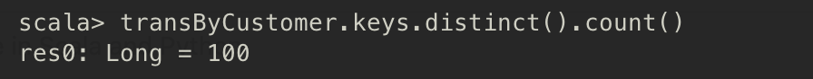
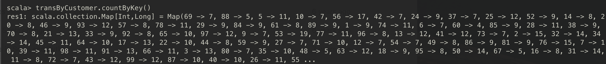
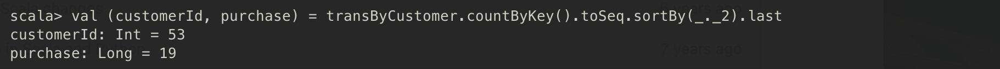
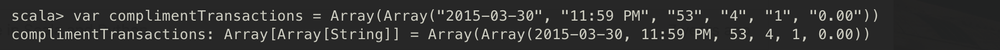

# Spark API
---
 학습목표

 1. Key-Value 데이터 쌍을 다루는 방법에 대해 알 수 있다.
 2. 데이터 파티셔닝과 셔플링에 대해 알 수 있다.
 3. Grouping, sorting, join 연산에 대해 알 수 있다.
 4. 누적 변수와 공유 변수를 사용하는 방법에 대해 알 수 있다.
---

## 1. Pair RDD 다루기
- Key-Value 쌍은 전통적으로 연관 배열 (associative array)이라는 자료구조를 사용해서 표현한다.
- Scala와 Java에서는 **map**이라고 한다.
- Spark 에서는 Key-Value 쌍으로 구성된 RDD를 **PairRDD**라고 한다.

## 2. Pair RDD 생성 & 구매 고객에 대한 분석 예제
- PairRDD 함수는 `PairRDDFunctions` 클래스에 정의되어 있다.

### 구매 고객 로그 파일을 읽어서 Pair RDD로 변환하기
```Scala
import org.apache.spark.sql.SparkSession

object PurchaseEvent {
  def main(args: Array[String]): Unit = {
    val spark = SparkSession.builder()
      .appName("Purchase Event")
      .master("local[*]")
      .getOrCreate()

    val sc = spark.sparkContext

    val tranFile = sc.textFile("/home/yegenieee/Desktop/Learning-Spark/spark-in-action/app/src/main/resource/ch04/ch04_data_transactions.txt") // 데이터를 로드한다
    val tranData = tranFile.map(_.split("#")) // 해시 문자로 파싱한 데이터가 tranData에 문자열 배열 형태로 저장된다
    var transByCustomer = tranData.map(transaction => (transaction(2).toInt, transaction)) // 파싱한 데이터를 튜플로 매핑하여 Pair RDD를 생성 (고객ID, transaction 배열)
    // transByCustomer 를 변수 (var)로 선언했기 때문에 단일 변수에 계속 유지하면서 갱신할 수 있게 된다
  }
}
```

### 키 및 값 가져오기
- 고객 ID 중복을 제거하고 고유 개수를 가져오기
- Pair RDD의 키 또는 값으로 구성된 새로운 RDD를 가져오기 : **`keys`**, **`values`**
    ```Scala
    transByCustomer.keys.distint().count()
    ```
    

### 키 별 개수 세기
- **`countByKey`** 라는 action 연산자를 이용하여 각 키의 출현 횟수를 Map 형태로 반환한다. action 연산자는 연산 결과를 즉시 객체로 반환한다.
   

- 가장 많이 구매한 고객에게 곰인형을 사은품으로 발송해야 하므로, 가장 많이 구매한 고객을 찾아보자
   

- 사은품을 발송하는 행위도 거래 내역에 추가해야하므로, String 배열 형태로 저장한다.
  


### 단일 키로 값 찾기
