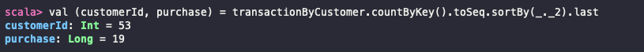
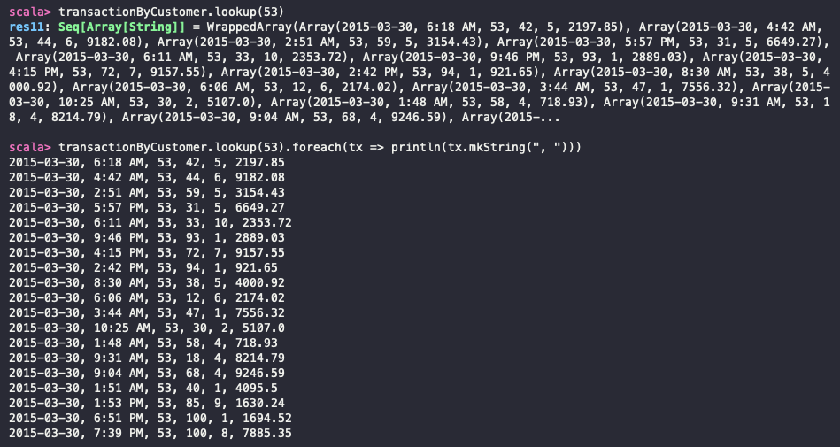

# Spark API
---
 학습목표

 1. Key-Value 데이터 쌍을 다루는 방법에 대해 알 수 있다.
 2. 데이터 파티셔닝과 셔플링에 대해 알 수 있다.
 3. Grouping, sorting, join 연산에 대해 알 수 있다.
 4. 누적 변수와 공유 변수를 사용하는 방법에 대해 알 수 있다.
---

## 1. Pair RDD 다루기
- Key-Value 쌍은 전통적으로 연관 배열 (associative array)이라는 자료구조를 사용해서 표현한다.
- Scala와 Java에서는 **map**이라고 한다.
- Spark 에서는 Key-Value 쌍으로 구성된 RDD를 **PairRDD**라고 한다.

---

## 2. Pair RDD 생성 & 구매 고객에 대한 분석 예제
- PairRDD 함수는 `PairRDDFunctions` 클래스에 정의되어 있다.

### 구매 고객 로그 파일을 읽어서 Pair RDD로 변환하기
```Scala
import org.apache.spark.sql.SparkSession

object PurchaseEvent {
  def main(args: Array[String]): Unit = {
    val spark = SparkSession.builder()
      .appName("Purchase Event")
      .master("local[*]")
      .getOrCreate()

    val sc = spark.sparkContext

    val tranFile = sc.textFile("/home/yegenieee/Desktop/Learning-Spark/spark-in-action/app/src/main/resource/ch04/ch04_data_transactions.txt") // 데이터를 로드한다
    val tranData = tranFile.map(_.split("#")) // 해시 문자로 파싱한 데이터가 tranData에 문자열 배열 형태로 저장된다
    var transByCustomer = tranData.map(transaction => (transaction(2).toInt, transaction)) // 파싱한 데이터를 튜플로 매핑하여 Pair RDD를 생성 (고객ID, transaction 배열)
    // transByCustomer 를 변수 (var)로 선언했기 때문에 단일 변수에 계속 유지하면서 갱신할 수 있게 된다
  }
}
```

### 키 및 값 가져오기
- 고객 ID 중복을 제거하고 고유 개수를 가져오기
- Pair RDD의 키 또는 값으로 구성된 새로운 RDD를 가져오기 : **`keys`**, **`values`**
    ```Scala
    transByCustomer.keys.distint().count()
    ```
    

### 키 별 개수 세기
- **`countByKey`** 라는 action 연산자를 이용하여 각 키의 출현 횟수를 Map 형태로 반환한다. action 연산자는 연산 결과를 즉시 객체로 반환한다.
   

- 가장 많이 구매한 고객에게 곰인형을 사은품으로 발송해야 하므로, 가장 많이 구매한 고객을 찾아보자
   

- 사은품을 발송하는 행위도 거래 내역에 추가해야하므로, String 배열 형태로 저장한다.
  


### 단일 키로 값 찾기
- **`lookup`** 라는 action 연산자를 이용하여 key에 해당하는 값들을 모두 가져올 수 있다.
- lookup 연산자는 결과 값을 Driver로 전송하므로, 이를 메모리에 적재할 수 있는지 먼저 확인해야 한다.
- 사은품을 받을 고객의 구매 내역 뽑아보기
    

### mapValues 변환 연산자로 Pair RDD 값 바꾸기
- **`mapValues`** transformation 연산자를 이용하여 Key를 변경하지 않고 Pair RDD에 포함된 Value만 변경할 수 있다.
- 상품 ID 25번을 두 개 이상 구매하면 청구 금액을 5% 할인해주기
    
     - 조건에 맞으면 배열을 변경하여 return 한다

### flatMapValues 변환 연산자로 Key에 Value 추가하기
- **`flatMapValues`** transformation 연산자는 각 key 값을 0개 또는 1개 이상의 값으로 매핑하여 RDD에 포함된 요소 개수를 변경한다
- 즉, 키에 새로운 값을 추가하거나 키 값을 모두 제거할 수 있다
- 함수가 반환한 컬렉션 값들을 원래 키와 합쳐서 새로운 key-value 쌍으로 생성한다
<br/><br/>
- return 시, 빈 컬렉션을 반환하면 -> 해당 key-value를 RDD에서 제거하고,
- 컬렉션에 두 개 이상의 값을 넣어서 return하면 -> 결과 Pair RDD에 이를 추가한다
- 상품 ID 81번을 5권 이상 구매한 고객에게 사은품으로 상품 ID 70번을 보내기 (구매 기록 추가)
   
   - 구매 기록 배열을 복제하여, 원래 요소와 추가한 요소를 같이 반환하여 구매 기록을 추가한다

### reduceByKey, foldByKey 를 이용하여 키의 모든 값들을 merge
- **`foldByKey`** 를 이용하여 각 키의 모든 값들을 동일한 타입의 단일 값으로 병합할 수 있다
- *foldByKey method signature*
    ```Scala
    foldByKey(zeroValue: V)(func: (V, V) => V): RDD[(K,V)]
    ```
    - zeroValue는 반드시 항등원이어야 한다 (덧셈 : 0, 곱셈 : 1, 리스트 연산 : Nil)
    - `zeroValue` : 가장 먼저 func 함수로 전달해서 key의 첫번째 값과 merge, 이 결과를 다시 key의 두 번째 값과 merge 한다
    - RDD 연산이 병렬로 실행되기 때문에 `zeroValue`가 여러 번 쓰일 수 있다는 것에 주의해야 한다
<br/><br/>
- 가장 많은 금액을 지출한 고객을 찾기
   
   - transByCustomer에 저장된 구매 기록은 문자열 배열이기 때문에, 금액 정보만 포함하도록 데이터를 매핑한 후 foldByKey를 사용한다.
   
   <br/><br/>
   - 만약, zeroValue를 100000으로 지정하면, zeroValue가 결과값에 여러번 (**RDD 파티션 개수만큼**) 더해지게 된다
       <br/> 
       <br/><br/>
- 사은품 구매 기록 추가 (complimentTransactions 에 추가)
    
<br/><br/>
- 고객 ID를 키로 설정하고, 구매 기록을 값으로 만들어서 RDD에 추가한 후 결과를 새로운 파일에 저장하기
    
    

---

## 3. 데이터 파티셔닝을 이해하고 데이터 셔플링 최소화
### Partitioning
- 데이터를 여러 클러스터 노드로 분할하는 메커니즘
- 스파크의 성능과 리소스 점유량을 크게 좌우할 수 있는 RDD의 가장 기본적인 개념

#### RDD Partition
- RDD 데이터의 일부를 의미하며,
- 텍스트 파일을 스파크에 로드하면, 스파크는 파일 내용을 여러 파티션으로 분할해서 클러스터 노드에 분산 저장한다.
- 이렇게 분산된 파티션이 모여서 하나의 RDD를 형성한다.

- RDD의 파티션 목록
  - RDD의 `partitions` 필드로 제공되는데, 이 필드는 Array이 타입이어서 `partitions.size` 가 바로 파티션 개수이다

- 스파크에서는 RDD의 파티션 개수가 중요한데, 파티션 개수가 데이터를 클러스터에 분배하는 과정에서 영향을 미치기도 하지만, 해당 RDD에 변환 연산을 실행할 태스크 개수와 직결되기 때문에 중요하다
- 태스크 개수가 필요 이하로 적으면 클러스터를 충분히 활용할 수 없다.
    - 각 태스크가 처리할 데이터 분량이 executor의 메모리 리소스를 초과하면 메모리 문제가 발생할 수 있다.
- 파티션의 개수는 클러스터의 코어 개수보다 3~4배 많게 지정하면 좋다.
- 태스크가 너무 많으면 태스크 관리 작업에 병목이 발생하므로, 너무 큰 값 또한 올바르지 않다.

### Spark의 데이터 Partitioner
- RDD의 데이터 파티셔닝은 RDD의 각 요소에 파티션 번호를 할당하는 `Partitioner` 객체가 수행한다.
- Spark에서는 Partitioner의 구현체로, `HashPartitioner`와 `RangePartitioner` 그리고 사용자 정의 `Partitioner`를 이용한다.

#### 1. HashPartitioner
- 스파크의 기본 Partitioner로, 각 요소의 자바 hash code(Pair RDD는 key의 hashcode)를 **mod 공식**에 대입해서 파티션 번호를 계산한다
    - partitionIndex = hashCode % numberOfPartitions
- 각 요소의 파티션 번호를 거의 무작위로 결정하기 때문에, **모든 파티션을 정확하게 같은 크기로 분할할 가능성은 낮다**
- 하지만, 대규모 데이터셋을 상대적으로 적은 수의 파티션으로 나누게 되면, 대체로 데이터를 고르게 분산시킬 수 있다
- 파티션의 기본 개수 = `spark.default.parallelism` 값
    - 해당 값 지정하지 않으면, 클러스터의 코어 개수를 파티션의 기본 개수로 사용한다

#### 2. RangePartitioner
- 정렬된 RDD의 데이터를 거의 같은 범위로 분할할 수 있다
- 잘 사용하지 않는다

#### 3. Pair RDD의 사용자 정의 Partitioner
- 파티션의 데이터를 특정 기준에 따라 정확하게 배치해야 할 경우 사용한다
- ex) 각 태스크가 특정 key-value 데이터만 처리해야 할 때 (ex) 특정 데이터가 단일 db, 단일 db table 에 속하는 경우)
- Pair RDD에만 사용할 수 있고, Pair RDD의 transformation 연산자 호출 시 사용자 정의 Partitioner를 인수로 전달한다.
  ```Scala
  rdd.foldByKey(afunction, 100)
  rdd.foldByKey(afunction, new HashPartitioner(100))
  ```

- Pair RDD transformation 연산자 호출 시 Partitioner를 지정하지 않으면, 스파크는 부모 RDD에 지정된 파티션 개수 중에 가장 큰 수를 이용한다
  - 부모 RDD가 없으면, `spark.default.parallelism` 에 지정된 파티션 개수로 HashPartitioner를 사용한다
  > 부모 RDD
  > - 현재 RDD를 만드는 데 사용한 RDD들

---

## 4. 불필요한 셔플링 줄이기
- Shuffling (셔플링)
    - 파티션 간의 물리적인 데이터 이동을 의미한다
    - 새로운 RDD의 파티션을 만들려고 여러 파티션의 데이터를 합칠 때 발생한다

### transformation 연산 수행 시, 발생하는 셔플링 과정
1. Transformation 함수는 각 파티션 별로 값을 merge한다.
2. 중간 파일에는 셔플링 수행 전 먼저 부분적으로 merge한 값을 저장한다. (**중간 파일에 기록**)
3. Merge 함수는 여러 파티션의 값을 최종 merge한다. (**여러 파티션에 저장된 값을 병합 후, Partitioner를 적용하여 각 키를 적당한 파티션에 할당**)

- Map task
   - 셔플링 바로 전에 수행한 task
   - 맵 태스크의 결과는 중간 파일에 기록한다 (주로 OS의 FileSystem Cache에만 저장)
- Reduce task
   - 셔플링 바로 다음에 수행한 task
   - 중간 파일을 읽어들여서 다음 job을 수행한다

- 결국, 중간 파일을 disk에 기록하는 작업도 부담이지만, 셔플링할 데이터를 **네트워크로 전송해야 하기 때문에** 스파크 잡의 셔플링 횟수를 최소한으로 줄여야 한다.

- RDD transformation 연산에는 대부분 셔플링이 필요하지는 않지만, 일부 연산에서는 특정 조건 하에서 셔플링이 발생하기도 한다.

### 셔플링이 발생하는 조건
#### 1. Partitioner를 명시적으로 변경하는 경우
#### 2. Partitioner를 제거하는 경우


## 5. RDD 의존 관계
