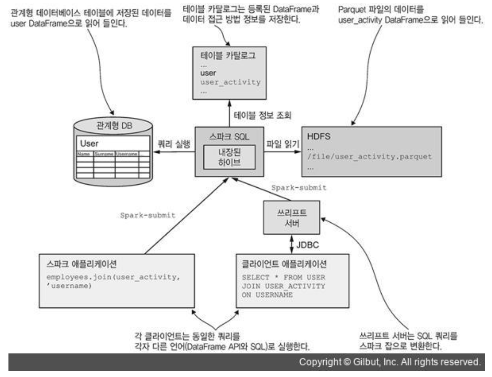
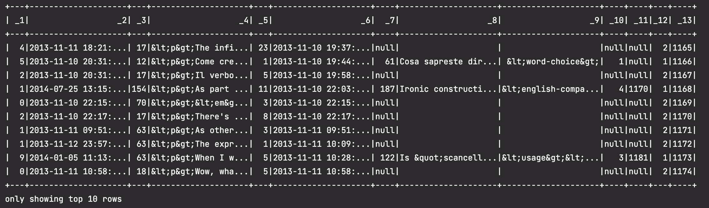
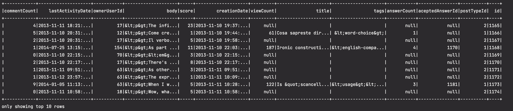
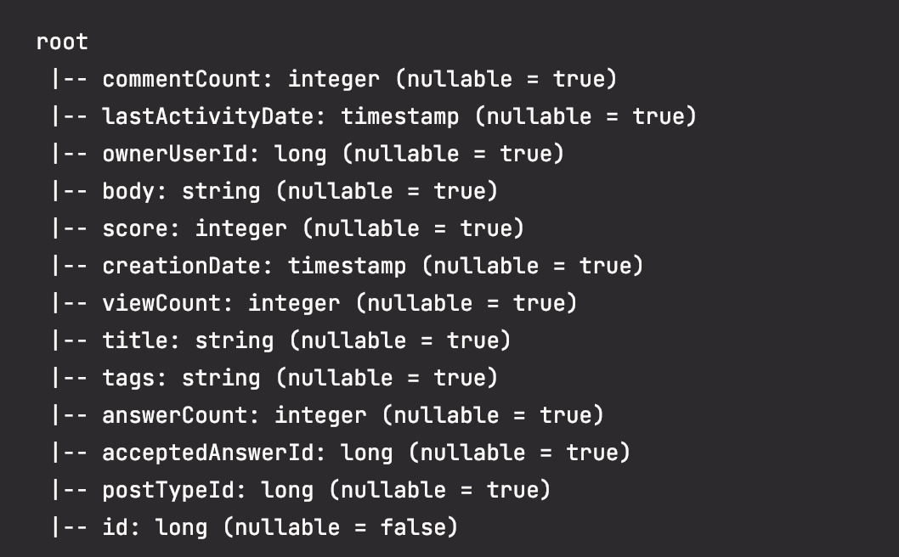
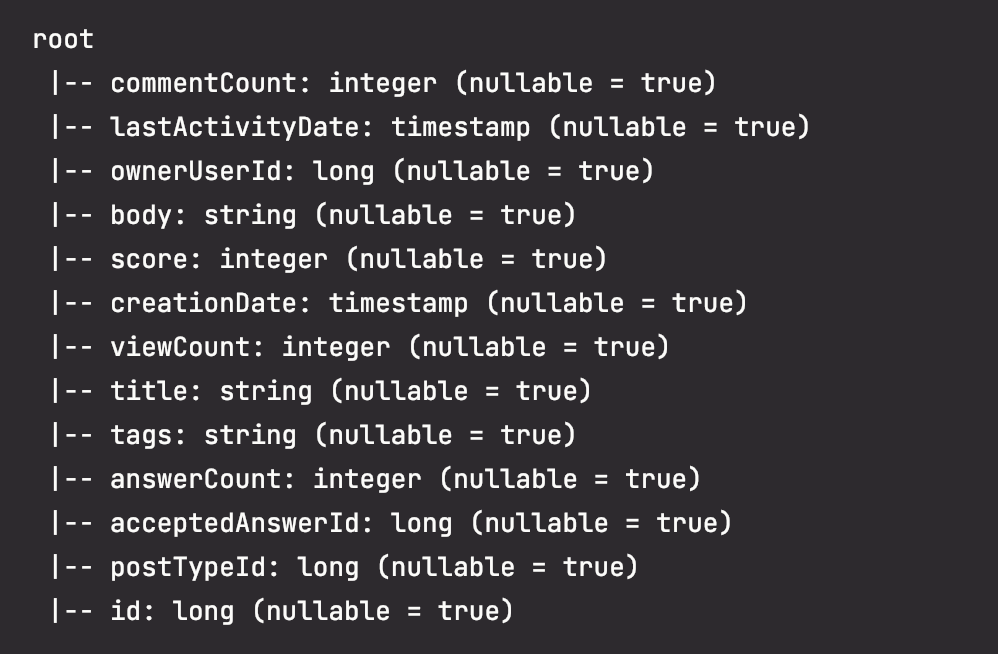
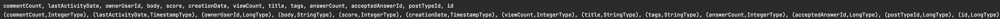

# Spark SQL

---
## 학습목표
1. DataFrame을 생성하는 방법에 대해 알 수 있다.
2. DataFrame API 사용법에 대해 알 수 있다.
3. DataSet에 대해 알 수 있다.
4. 외부 데이터를 로드 및 저장하는 방법에 대해 알 수 있다.
---
## 정형 데이터 (Structured Data)
- 관계형 데이터베이스 시스템의 테이블과 같이 고정된 컬럼에 저장되는 데이터와 파일, 그리고 지정된 행과 열에 의해 데이터 속성이 구별되는 스프레드시트 형태의 데이터 등
- 데이터가 스키마 구조를 가지고 있기 때문에 데이터를 탐색하는 과정이 테이블 탐색, 컬럼 구조 탐색, 로우 탐색 순으로 정형화 되어있다.
- 형식을 가지고 있기 때문에 수집이 쉬운 편
- CRUD가 일어나는 일반적인 아키텍처 구조로 이루어져 있다

## 비정형 데이터
- 하나의 데이터가 수집 데이터로 객체화되어있다.
- 이진 파일 형태 : 동영상, 이미지
- 스크립트 파일 형태 : 소셜 데이터의 텍스트
- 텍스트 마이닝 혹은 파일인 경우 데이터 형태로 파싱해야 하기 때문에 수집이 어려운 편
- 텍스트나 파일을 파싱하여 메타 구조를 갖는 데이터의 셋 형태로 바꾸고 정형 데이터 형태의 구조로 만들 수 있도록 아키텍처 구조를 수정해야 한다

## 1. DataFrame 다루기
- RDD는 spark 전용 분산 컬렉션, 1. 불변성, 2. 복원성, 3. 분산의 특징을 가지고 있다 (한 번 생성된 RDD는 절대 바뀌지 않는 immutable한 특징을 가지고 있다. 불변성 & 복원성을 통해서 분산 시스템에서 가장 중요한 장애 대응을 할 수 있다.)
    - 어떻게?
          - 일반적인 분산 프레임워크에서는 노드에 장애가 발생하면 replica를 가져와서 데이터를 복원하는데,
          - spark의 RDD는 데이터셋 자체를 중복 저장하는게 아니라, 데이터셋을 만드는 데 사용된 transformation 연산자의 로그를 남기는 방식으로 장애 대응을 한다.
          - 스파크에서는 일부 노드에 장애가 발생하면, 해당 노드가 가진 데이터셋만 다시 계산해서 RDD를 복원한다.

          - transformation 연산자 : 항상 새로운 RDD 객체를 만든다.
          - action 연산자 : 연산자를 호출한 프로그램으로 계산 결과를 반환하거나 RDD 요소에 특정 작업을 수행하려고 실제 계산을 시작한다.
- RDD는 데이터를 직접 다룰 수 있는 스파크 하위 레벨 interface의 핵심이다

## DataFrame
- 스파크 v1.3에서 소개된 DataFrame API는 컬럼 이름과 타입이 지정된 테이블 형식의 분산 정형 데이터를 손쉽게 다룰 수 있는 상위 레벨 인터페이스를 제공한다.
- SQL 및 도메인 특화 언어로 작성된 표현식을 최적화된 하위 레벨 RDD 연산으로 변환한다
- 동일한 DataFrame API를 스파크가 지원하는 모든 언어와 데이터 소스에 동일한 방식과 유사한 성능으로 사용할 수 있다.
- 스파크 버전 2.0에서는 DataFrame을 Dataset의 일종으로 구현하였다
- 정형 데이터를 효과적으로 다룰 수 있음
  - 컬럼 이름으로 데이터를 참조할 수 있음
  - SQL 쿼리를 이용해서 데이터에 접근할 수 있음

- table catalog : Spark Context를 종료해도 계속 유지되는 영구적인 메타데이터 저장소
  - Hive 지원 기능이 포함된 Spark에서만 사용할 수 있다
- 스파크 SQL을 이용하여 두 클라이언트가 동일한 쿼리를 실행하는 예시
- RDD를 기반으로 동작하므로, RDD 실행 원리들이 DataFrame에도 유효하다
- DataFrame에는 모든 컬럼의 타입을 미리 지정하므로 RDD에 비해 더 간결하고 손쉽게 쿼리를 작성할 수 있고, 쿼리를 최적화할 수 있다

<br/><br/>

- DataFrame은 RDD와 유사할뿐만 아니라 RDD를 기반으로 동작한다.

### DataFrame을 생성하는 방법
1. 기존 RDD를 변환하는 방법
2. SQL 쿼리를 실행하는 방법
3. 외부 데이터에서 로드하는 방법

### RDD에서 DataFrame 생성
- 데이터를 먼저 RDD로 로드한 후 DataFrame으로 변환하는 방법을 가장 많이 사용한다

### RDD에서 DataFrame을 생성하는 방법
1. row의 데이터를 튜플 형태로 저장한 RDD를 사용하는 방법 (스키마 속성을 지정할 수 없어서 제한적이다)
2. case class를 사용하는 방법
3. 스키마를 명시적으로 지정하는 방법
- 1~2번은 스키마를 간접적으로 지정 (추론)한다


### Spark DataFrame과 SQL 표현식을 사용하기
- 스파크 DataFrame과 SQL 표현식을 사용하려면 먼저 SparkSession 객체를 준비해야 한다
```scala
import org.apache.spark.sql.SparkSession
val spark = SparkSession.builder().getOrCreate()
```
- `SparkSession` : SparkContext와 SQLContext를 통합한 Wrapper 클래스
- `builder()` 가 반환하는 Builder 객체는 스파크 마스터 및 appName 그리고 여러 옵션을 설정한다
- 스파크는 RDD를 DataFrame으로 자동 변환하는 데 필요한 암시적 스칼라 메서드들을 제공한다
  - `import spark.implicits._` : 암시적 스칼라 메서드를 사용하기 위해서 import 한다
    - `SparkSession의 implicits` 객체 : Dataset Encoder가 정의된 객체로 구성한 RDD에 `toDF` 라는 메서드를 추가함
      - Encoder : 스파크 SQL이 내부적으로 JVM 객체를 테이블 형식으로 변환하는 데 사용하는 trait

### 예제 데이터 파일을 파싱하고 RDD로 로드하기
```scala
import org.apache.spark.sql.SparkSession

object ItalianPost {
  def main(args: Array[String]): Unit = {
    val spark = SparkSession
      .builder()
      .appName("ItalianPost")
      .master("local[*]")
      .getOrCreate()

    val sc = spark.sparkContext

    val itPostsRows = sc.textFile("/Users/yejchoi-mn/Desktop/spark-in-action/book/spark/src/main/resources/ch05/italianPosts.csv")
    val itPostsSplit = itPostsRows.map(x => x.split("~"))
  }
}
```
- `itPostsSplit` : 문자열 배열로 구성된 RDD를 반환하는데, 여기에 `toDF` 메서드를 호출해서 문자열 배열 타입의 단일 컬럼을 가진 DataFrame을 얻을 수도 있음
- 근데 우리는 배열의 각 문자열을 컬럼으로 매핑할거라 다른 방법이 필요

### 튜플 형식의 RDD에서 DataFrame 생성
```scala
import spark.implicits._

val itPostsRDD = itPostsSplit.map(x => (x(0), x(1), x(2), x(3), x(4), x(5), x(6), x(7), x(8), x(9), x(10), x(11), x(12)))
val itPostsDFrame = itPostsRDD.toDF() // DataFrame으로 변환
itPostsDFrame.show(10)
```
- RDD의 배열을 튜플로 변환하고 `toDF`를 호출해서 DataFrame을 생성


#### toDF 메서드에 컬럼 이름을 전달해서 DataFrame을 생성
```scala
val itPostsDF = itPostsRDD.toDF("commentCount", "lastActivityDate", "ownerUserId", "body", "score", "creationDate", "viewCount", "title", "tags", "answerCount", "aceptedAnswerId", "postTypeId", "id")
itPostsDF.show(10)
```



#### printSchema를 이용해서 DataFrame 스키마를 살펴보기
```scala
itPostsDF.printSchema
```

- `printSchema` : 이 DataFrame이 가진 컬럼 정보를 출력한다
- 모든 컬럼의 타입이 String이며 nullable인 걸 확인할 수 있다
- RDD를 DataFrame으로 변환할 때 컬럼 이름과 데이터 타입을 지정할 수 있는 방법을 알아보자!

## Case class를 사용해서 RDD를 DataFrame으로 변환
- RDD의 각 로우를 case class로 매핑한 후에 `toDF` 메서드를 호출하는 것
- case class 선언
```scala
import java.sql.Timestamp

case class Post(
               commentCount: Option[Int],
               lastActivityDate: Option[java.sql.Timestamp],
               ownerUserId: Option[Long],
               body: String,
               score: Option[Int],
               creationDate: Option[java.sql.Timestamp],
               viewCount: Option[Int],
               title: String,
               tags: String,
               answerCount: Option[Int],
               acceptedAnswerId: Option[Long],
               postTypeId: Option[Long],
               id: Option[Long]
               )
```
- nullable 필드 : `Option[T]` 타입으로 선언
  - 임의의 T 타입 값을 가진 Some 객체나 None (자바에서의 Null) 객체가 포함될 수 있다
- 암시적 클래스
  ```scala
  import java.sql.Timestamp

  object StringImplicits {
    implicit class StringImprovements(val s: String) {
      import scala.util.control.Exception.catching
      def toIntSafe = catching(classOf[Number]) opt s.toInt
      def toLongSafe = catching(classOf[Number]) opt s.toLong
      def toTimeStampSafe = catching(classOf[IllegalArgumentException]) opt Timestamp.valueOf(s)
    }
  }
  ```
  - 위에서 선언한 메서드를 사용해서 DataFrame 문자열 필드를 각각 integer, long, Timestamp 타입으로 안전하게 변환할 수 있다
    - 안전환 변환
      - 문자열을 각 타입으로 변환할 수 없을 때, 예외를 던지는 대신 None을 반환한다
      - catching 함수 : `scala.util.control.Exception.Catch` 타입의 객체를 반환한다
        - 이 객체의 `opt` 메서드 : 사용자가 지정한 함수 결과를 (ex) s.toInt) Option 객체로 매핑한다
        - 이 Option 객체는 사용자가 catching 함수에 지정한 타입의 예외가 발생할 경우 None을 반환하며, 그 외에는 Some 객체를 반환한다
### 암시적 클래스로 정의한 메서드를 사용해서 로우를 파싱
```scala
def stringToPost(row:String): Post = {
  val r = row.split("~")
  Post(
    r(0).toIntSafe,
    r(1).toTimeStampSafe,
    r(2).toLongSafe,
    r(3),
    r(4).toIntSafe,
    r(5).toTimeStampSafe,
    r(6).toIntSafe,
    r(7),
    r(8),
    r(9).toIntSafe,
    r(10).toLongSafe,
    r(11).toLongSafe,
    r(12).toLong
  )
}

val itPostsDFCase = itPostsRows.map(x => stringToPost(x)).toDF()
```
- 각 필드를 적절한 타입의 객체로 파싱함


- 각 필드의 타입이 명시적으로 변경된 것을 확인할 수 있다

## 3. 스키마를 지정하여 RDD를 DataFrame으로 변환
- `SparkSession`의 `createDataFrame` 메서드를 사용하여 RDD를 DataFrame으로 변환한다
  - `createDataFrame` 메서드 : Row 타입의 객체를 포함하는 `RDD`와 `StructType` 객체를 인자로 전달해 호출 가능하다

### StructType 스키마 정의
```scala
import org.apache.spark.sql.types._
val postSchema = StructType(Seq(
  StructField("commentCount", IntegerType, true),
  StructField("lastActivityDate", TimestampType, true),
  StructField("ownerUserId", LongType, true),
  StructField("body", StringType, true),
  StructField("score", IntegerType, true),
  StructField("creationDate", TimestampType, true),
  StructField("viewCount", IntegerType, true),
  StructField("title", StringType, true),
  StructField("tags", StringType, true),
  StructField("answerCount", IntegerType, true),
  StructField("acceptedAnswerId", LongType, true),
  StructField("postTypeId", LongType, true),
  StructField("id", LongType, false)
))
```
- `StructType` : 스파크 SQL의 테이블 스키마를 표현하는 클래스
  - 테이블 컬럼을 표현하는 `StructField` 객체를 한 개 또는 여러 개 가질 수 있다

```scala
import org.apache.spark.sql.Row
def stringToRow(row:String):Row = {
  val r = row.split("~")
  Row(
    r(0).toIntSafe.getOrElse(null),
    r(1).toTimeStampSafe.getOrElse(null),
    r(2).toLongSafe.getOrElse(null),
    r(3),
    r(4).toIntSafe.getOrElse(null),
    r(5).toTimeStampSafe.getOrElse(null),
    r(6).toIntSafe.getOrElse(null),
    r(7),
    r(8),
    r(9).toIntSafe.getOrElse(null),
    r(10).toLongSafe.getOrElse(null),
    r(11).toLongSafe.getOrElse(null),
    r(12).toLong
  )
}

val rowRDD = itPostsRows.map(row => stringToRow(row))
val itPostsDFStruct = spark.createDataFrame(rowRDD, postSchema)
```
- Row 클래스에 데이터를 담으려면 각 요소를 직접 지정하거나 , Seq나 Tuple 객체를 전달하여 Row 객체를 구성해야 한다
- spark 버전 2.0과 scala의 Option 객체가 잘 호환되지 않는 관계로 이 방법으로 DataFrame을 생성할 때는 자바의 null 값을 사용해야 한다
- `spark.createDataFrame(rowRdd, postSchema)` : 이렇게 DataFrame을 생성할 수 있다

## 스키마 정보 가져오기


```scala
itPostsDFCase.columns
itPostsDFStruct.dtypes
```
- `columns` : 컬럼 이름 목록을 반환
- `dtypes` : 각 컬럼 이름과 타입으로 구성된 튜플 목록을 반환

